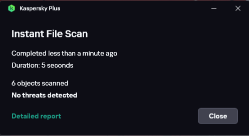
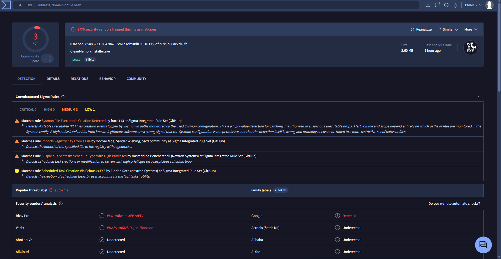

<div align="center">

  
  
  
  

  # ⚡ PRIMES Clean Memory

  **A zero-bloat, background RAM optimization utility that purges system standby lists and working sets instantly.**

  [Key Features](#key-features) • [How It Works](#how-it-works) • [Security & Scan Evidence](#security--scan-evidence) • [Installation](#installation) • [License](#license)

  <br />

  <!-- HERO IMAGE SHOWCASE (Sized to fit vertical context menus naturally) -->
  <a href="https://github.com/Primes-23/PRIMES-Clean-Memory">
    
  </a>

  <br />
  <sub><i>Instant RAM purging integrated cleanly into your Windows context menu.</i></sub>

</div>

---

## 🌟 Overview

**PRIMES Clean Memory** is an open-source Windows optimization utility engineered to resolve micro-stutters, memory leaks, and high standby RAM usage during heavy gaming and multitasking. Unlike continuous background memory cleaners that waste system resources sitting idle, PRIMES Clean Memory executes **strictly on demand** or via scheduled triggers—freeing gigabytes of cached RAM in milliseconds.

---

## ✨ Key Features

* 🚀 **Instant RAM Purge**: Empties system working sets and standby memory allocations instantly via native Windows kernel APIs.
* 👻 **Zero Background Overhead**: Consumes **0 MB RAM** while idle because it executes on demand rather than remaining resident in memory.
* 🤫 **Silent Execution**: Operates completely in the background without intrusive CMD popups or screen flickering during gameplay.
* 🛡️ **UAC Elevation Handling**: Built-in privilege routing allows memory management operations to execute smoothly without repetitive UAC prompts.
* 📦 **Automated Setup**: Custom installer script manages file directory extraction, context menu integration, and task scheduling automatically.

---

## 🛠️ How It Works

```text
User Context Menu / Task Scheduler
               │
               ▼
      PRIMES Clean Memory
               │
               ▼
Windows Kernel API Execution (EmptyWorkingSet / Memory Purge)
               │
               ▼
Standby List & Cache Released ──► System RAM Restored Instantly
```

---

## 🛡️ Security & Scan Evidence

Because this utility is compiled using AutoHotkey stubs and interacts directly with system RAM management APIs (`EmptyWorkingSet`), some cloud heuristic engines may flag the unsigned binary. Full local and cloud security breakdowns are provided below for complete transparency.

### 🔍 Local Antivirus Verification (Kaspersky Plus)
<div align="center">
  
  <p><sub><i>100% Clean local file scan verified by Kaspersky Plus.</i></sub></p>
</div>

<br />

### 🌐 Cloud Analysis Report (VirusTotal)
<div align="center">
  
  <p><sub><i>67/70 Clean detection ratio on VirusTotal (BitDefender, Kaspersky, CrowdStrike clean).</i></sub></p>
</div>

> **Note on False Positives**: The 3 generic flags (e.g., *Bkav*, *Varist*) are standard false positives triggered by unsigned AutoHotkey compilation stubs making privileged system RAM purge API calls.

* **Installer File**: `CleanMemoryInstaller.exe`
* **SHA-256 Hash**: `036ebed885a832231884284763c61a1db90db716163955df997c5b06ae2d18fb`

---

## 📥 Installation

1. Download **`CleanMemoryInstaller.exe`** from the official **[Releases Page](https://github.com/Primes-23/PRIMES-Clean-Memory/releases)**.
2. Right-click the downloaded executable and select **Run as administrator**.
3. Complete the installation process to set up files and desktop context menu integration.
4. Right-click your desktop and select **Clean Memory** anytime to free up RAM!

---

## 📄 License

Distributed under the **MIT License**. See [`LICENSE`](LICENSE) for full details.
